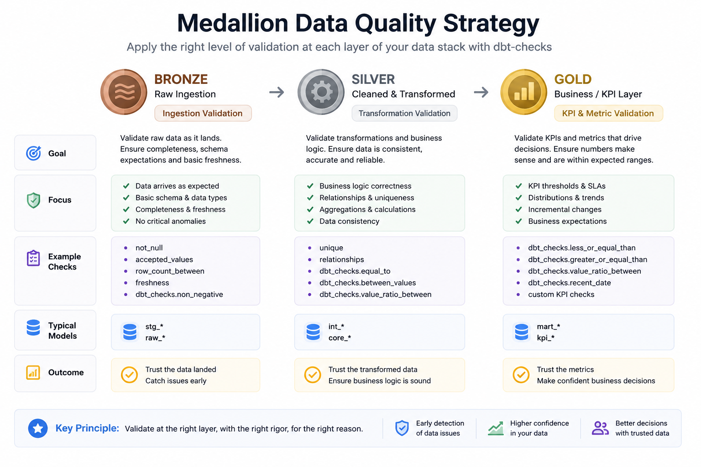
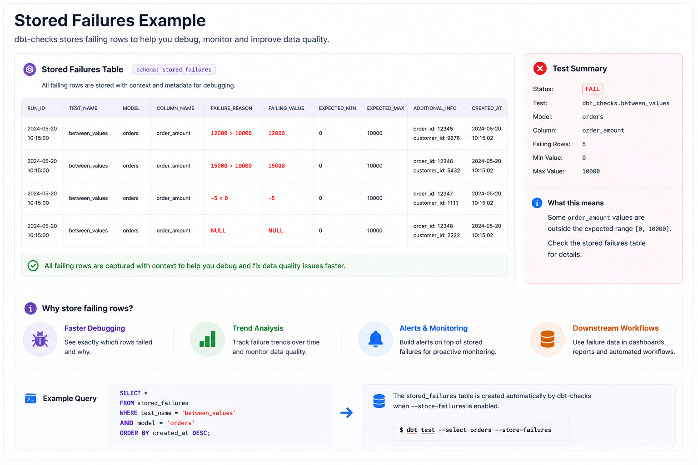
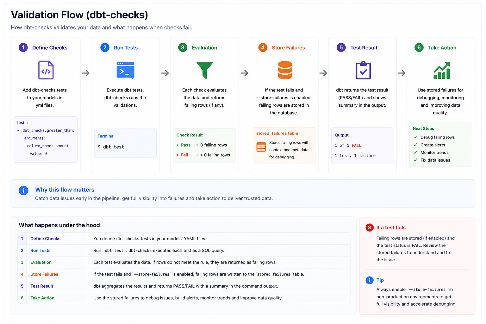
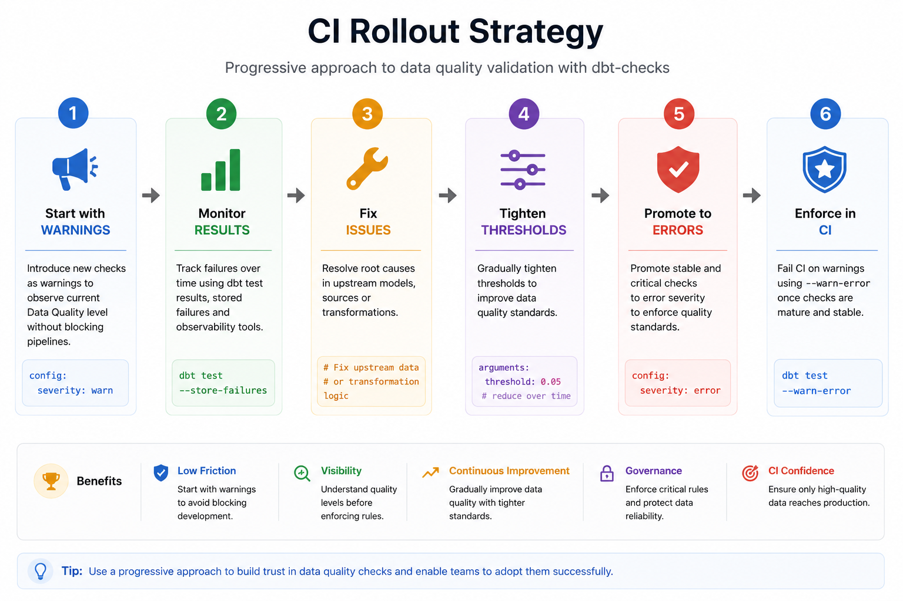
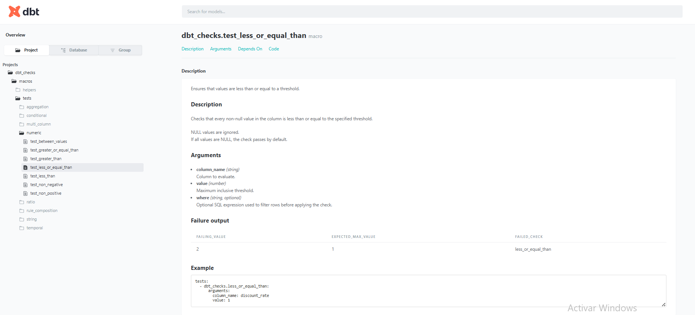
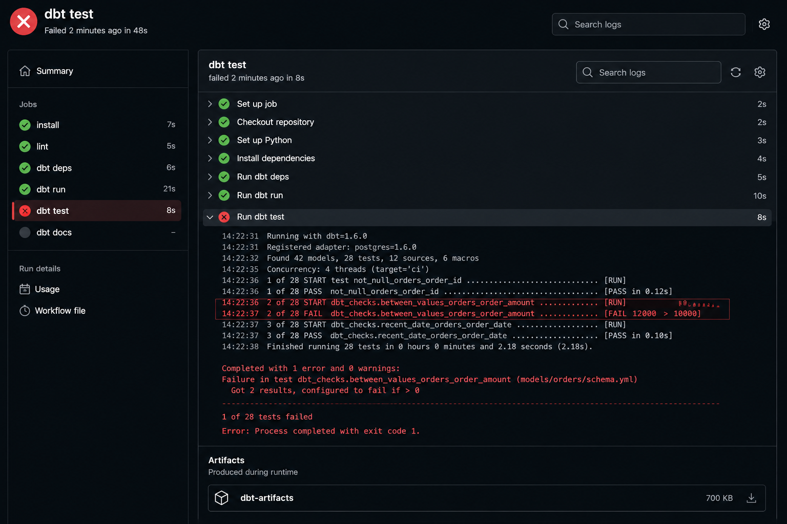

# Examples

This document contains practical examples demonstrating how `dbt-checks` can be used in real-world projects.

The examples focus on common data quality scenarios found in analytics engineering, data warehousing, and business intelligence environments.

---

# Ecommerce Example

## Validate Order Amounts

Ensure order values fall within an expected range.

```yaml
columns:
  - name: order_amount
    data_tests:
      - dbt_checks.between_values:
          arguments:
            min_value: 0
            max_value: 10000
```

---

## Validate Completed Order Ratio

Ensure most orders are completed.

```yaml
columns:
  - name: status
    data_tests:
      - dbt_checks.value_ratio_between:
          arguments:
            value: completed
            min_ratio: 0.70
            max_ratio: 1.00
```

---

## Validate Recent Orders

Ensure data is refreshed daily.

```yaml
columns:
  - name: order_date
    data_tests:
      - dbt_checks.recent_date:
          arguments:
            max_age_days: 1
```

---

# Finance Example

## Validate Non-Negative Balances

```yaml
columns:
  - name: account_balance
    data_tests:
      - dbt_checks.non_negative
```

---

## Validate Transaction Amounts

```yaml
columns:
  - name: transaction_amount
    data_tests:
      - dbt_checks.between_values:
          arguments:
            min_value: -100000
            max_value: 100000
```

---

## Validate Daily Transaction Volume

```yaml
data_tests:
  - dbt_checks.row_count_greater_than:
      arguments:
        value: 1000
```

---

# Customer Data Example

## Validate Email Format

```yaml
columns:
  - name: email
    data_tests:
      - dbt_checks.matches_regex:
          arguments:
            regex: '^[^@]+@[^@]+\.[^@]+$'
```

---

## Validate Country Codes

```yaml
columns:
  - name: country_code
    data_tests:
      - dbt_checks.length_between:
          arguments:
            min_value: 2
            max_value: 2
```

---

## Validate Customer Completeness

```yaml
columns:
  - name: customer_id
    data_tests:
      - dbt_checks.null_ratio_below:
          arguments:
            value: 0.01
```

---

# SaaS Example

## Validate Active Tenant Coverage

```yaml
data_tests:
  - dbt_checks.row_count_greater_than:
      arguments:
        value: 100
        group_by: tenant_id
```

---

## Validate Tenant Freshness

```yaml
columns:
  - name: event_date
    data_tests:
      - dbt_checks.recent_date:
          arguments:
            max_age_days: 2
            group_by: tenant_id
```

---

## Validate Event Status Distribution

```yaml
columns:
  - name: event_status
    data_tests:
      - dbt_checks.value_ratio_between:
          arguments:
            value: processed
            min_ratio: 0.95
            max_ratio: 1.00
            group_by: tenant_id
```

---

# Medallion Architecture Example



This example demonstrates how different validation strategies can be applied across medallion layers.

## Bronze Layer

Validate ingestion freshness.

```yaml
columns:
  - name: ingestion_date
    data_tests:
      - dbt_checks.not_future_date
```

---

## Silver Layer

Validate transformed business rules.

```yaml
columns:
  - name: revenue
    data_tests:
      - dbt_checks.non_negative
```

---

## Gold Layer

Validate KPI stability.

```yaml
data_tests:
  - dbt_checks.row_count_between:
      arguments:
        min_value: 100
        max_value: 1000000
```

---

# Conditional Validation Example

## Cancelled Orders Must Have Cancellation Date

```yaml
data_tests:
  - dbt_checks.require_not_null_when:
      arguments:
        when: "status = 'cancelled'"
        column_name: cancelled_at
```

---

## Paid Orders Must Have Payment Date

```yaml
data_tests:
  - dbt_checks.require_when:
      arguments:
        when: "payment_status = 'paid'"
        require: "paid_at is not null"
```

---

# Rule Composition Example

## Financial Integrity Rules

```yaml
data_tests:
  - dbt_checks.all_of:
      arguments:
        expressions:
          - "total_amount >= 0"
          - "discount_amount >= 0"
          - "discount_amount <= total_amount"
```

---

## Contactability Rules

```yaml
data_tests:
  - dbt_checks.any_of:
      arguments:
        expressions:
          - "email is not null"
          - "phone is not null"
```

---

# Grouped Validation Example


Grouped checks validate each segment independently instead of validating the whole dataset globally.

## Revenue by Country

```yaml
data_tests:
  - dbt_checks.avg_between:
      arguments:
        column_name: revenue
        min_value: 10
        max_value: 1000
        group_by: country
```

---

## Null Ratio by Source System

```yaml
columns:
  - name: customer_id
    data_tests:
      - dbt_checks.null_ratio_below:
          arguments:
            value: 0.05
            group_by: source_system
```

---

# Stored Failures Example



`dbt-checks` integrates well with dbt stored failures workflows.

This allows failing rows to be persisted for:

* debugging
* monitoring
* alerting
* operational visibility

---

# Validation Flow



The validation lifecycle typically follows:

1. define checks
2. execute tests
3. evaluate results
4. store failures
5. expose failures
6. take action

---

# Scoped Validation Example

Validate only active records.

```yaml
columns:
  - name: balance
    data_tests:
      - dbt_checks.non_negative:
          config:
            where: "status = 'active'"
```

---

# CI-Friendly Validation Example



Use warnings during rollout.

```yaml
columns:
  - name: customer_id
    data_tests:
      - dbt_checks.null_ratio_below:
          arguments:
            value: 0.05
          config:
            severity: warn
```

Later, promote to errors.

```yaml
columns:
  - name: customer_id
    data_tests:
      - dbt_checks.null_ratio_below:
          arguments:
            value: 0.05
          config:
            severity: error
```

---

# Recommended Rollout Strategy

For existing projects:

1. Start with warning severity
2. Measure current quality levels
3. Fix existing issues
4. Gradually tighten thresholds
5. Promote critical checks to errors

This approach minimizes disruption while improving data quality over time.

---

# dbt Docs Example



`dbt-checks` integrates naturally with dbt documentation workflows and exposes test metadata directly through dbt docs.

---

# CI Failure Example



CI integration helps teams detect issues early before invalid data reaches downstream consumers.

---

## Related Documentation

* [Overview](overview.md)
* [Checks](checks.md)
* [Grouped Checks](grouped-checks.md)
* [Conditional Checks](conditional-checks.md)
* [Rule Composition](rule-composition.md)
* [Architecture](architecture.md)
* [CI](ci.md)
