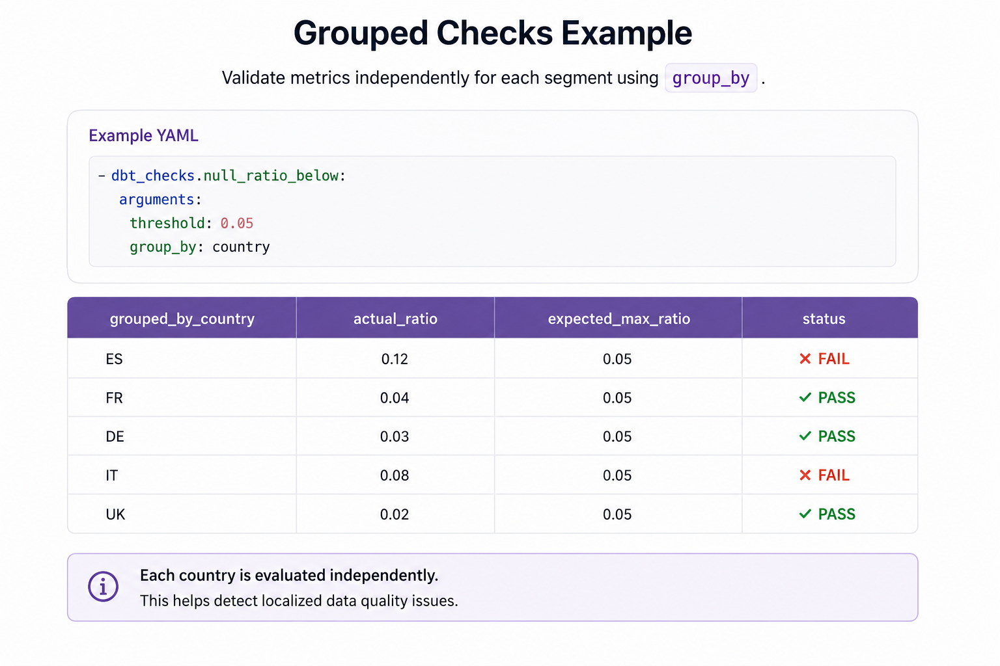

# Grouped Checks

Grouped checks allow validations to run independently for each segment of a dataset.

This is useful when data quality rules should be evaluated per:

- country
- tenant
- region
- source system
- sales channel
- product category
- partition

Grouped validation is enabled through the `group_by` argument.

---

# Why Grouped Checks?

A global check can hide segment-level problems.



For example, this check:

```yaml
- dbt_checks.null_ratio_below:
    arguments:
      threshold: 0.05
```

validates the whole model.

But this check:

```yaml
- dbt_checks.null_ratio_below:
    arguments:
      threshold: 0.05
      group_by: country
```

validates each country independently.

This makes it easier to detect localized data quality issues.

---

# Supported Grouped Categories

Grouped validation is supported for:

- aggregation checks
- ratio checks
- freshness checks

---

# Grouped Aggregation Checks

Grouped aggregation checks validate aggregate metrics per segment.

Supported checks include:

- `row_count_greater_than`
- `row_count_less_than`
- `row_count_between`
- `sum_between`
- `avg_between`
- `min_between`
- `max_between`
- `distinct_count_between`
- `duplicate_count_between`
- `duplicate_group_count_between`
- `max_duplicate_group_size_between`

## Example

```yaml
models:
  - name: orders
    data_tests:
      - dbt_checks.avg_between:
          arguments:
            column_name: order_value
            min_value: 10
            max_value: 500
            group_by: country
```

This validates the average order value independently for each country.

---

# Grouped Ratio Checks

Grouped ratio checks validate proportions independently per segment.

Supported checks include:

- `null_ratio_below`
- `null_ratio_between`
- `positive_ratio_between`
- `negative_ratio_between`
- `value_ratio_between`
- `distinct_ratio_between`
- `unique_combination_ratio_between`
- `duplicate_ratio_between`

## Example

```yaml
models:
  - name: orders
    columns:
      - name: status
        data_tests:
          - dbt_checks.value_ratio_between:
              arguments:
                value: "completed"
                min_ratio: 0.7
                max_ratio: 1.0
                group_by: country
```

This validates the completed order ratio independently for each country.

---

# Grouped Freshness Checks

`recent_date` supports grouped freshness validation.

## Example

```yaml
models:
  - name: events
    columns:
      - name: event_date
        data_tests:
          - dbt_checks.recent_date:
              arguments:
                max_age_days: 7
                group_by: country
```

This validates that each country has recent data.

---

# Multi-column Grouping

Grouped checks support multiple grouping columns.

## Example

```yaml
group_by:
  - country
  - sales_channel
```

This validates each `(country, sales_channel)` combination independently.

Example:

```yaml
models:
  - name: orders
    columns:
      - name: status
        data_tests:
          - dbt_checks.value_ratio_between:
              arguments:
                value: "completed"
                min_ratio: 0.7
                max_ratio: 1.0
                group_by:
                  - country
                  - sales_channel
```

---

# Grouped Failure Outputs

Grouped checks expose grouped context in failure outputs.


Example:

| grouped_by_country | actual_ratio | expected_max_ratio |
| --- | --- | --- |
| ES | 0.92 | 0.80 |

For multi-column grouping:

| grouped_by_country | grouped_by_sales_channel | actual_ratio |
| --- | --- | --- |
| ES | online | 0.80 |

---

# Grouped Aliases

For simple column-based grouping, `dbt-checks` exposes readable output aliases.

Example:

```yaml
group_by: country
```

Output:

```text
grouped_by_country
```

For complex SQL expressions, `dbt-checks` falls back to stable indexed aliases.

Example:

```text
grouped_by_1
grouped_by_2
```

---

# Grouped Checks with `where`

Grouped checks support dbt native `where` configuration.

Example:

```yaml
models:
  - name: orders
    data_tests:
      - dbt_checks.row_count_greater_than:
          arguments:
            value: 100
            group_by: status
          config:
            where: "created_at >= current_date - interval '30 days'"
```

This filters rows before grouped validation is applied.

---

# Common Use Cases

## Tenant validation

```yaml
group_by: tenant_id
```

Useful for multi-tenant applications.

## Country validation

```yaml
group_by: country
```

Useful for regional data quality monitoring.

## Source system validation

```yaml
group_by: source_system
```

Useful for ingestion monitoring.

## Partition validation

```yaml
group_by: event_date
```

Useful for detecting stale or incomplete partitions.

---

## Related Documentation

* [Overview](overview.md)
* [Checks](checks.md)
* [Conditional Checks](conditional-checks.md)
* [Rule Composition](rule-composition.md)
* [Architecture](architecture.md)
* [Examples](examples.md)
* [CI](ci.md)
